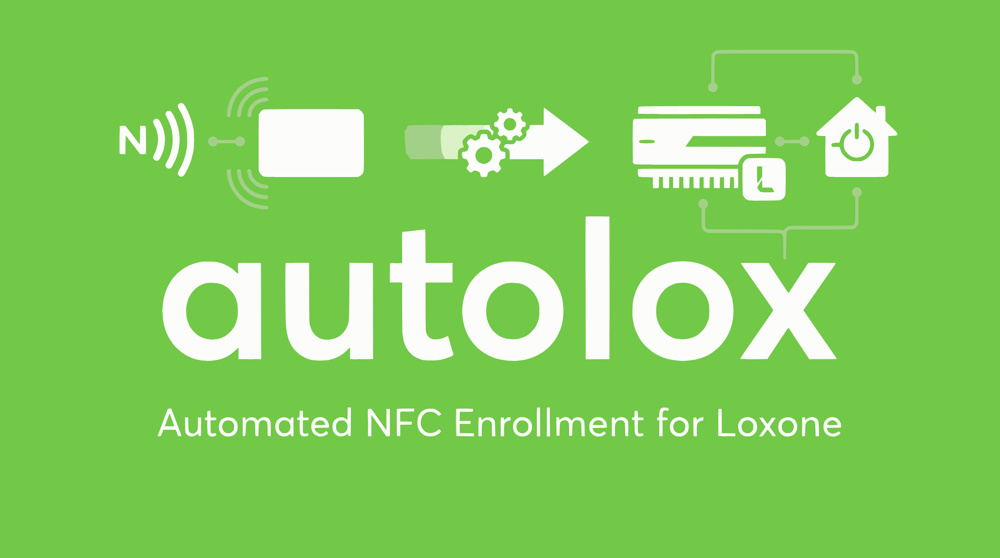

# autolox

Bulk NFC card enrolment for Loxone Miniservers. Replaces the manual "one card
at a time in the Loxone web UI" workflow with a tap-and-go tool: tap a card,
it captures the tag ID off the state stream, binds it to the next name in a
roster, moves on.

Written for a seasonal 200-300-worker enrolment cycle, but useful anywhere
you'd otherwise be clicking "NFC Tag aanleren" 250 times.

## Two ways to run it

- **Web app** — FastAPI backend + browser UI. Paste roster → pick user +
  reader → review → tap cards. Big legible "next card" overlay for
  head-down work. Session history with roster audit + resume. Meant to run
  in an LXC container or locally.
- **CLI** — same underlying library, single command per session. Handy for
  scripts and quick tests.

## Quick start

```
git clone https://github.com/<you>/autolox.git
cd autolox
python3 -m venv .venv && . .venv/bin/activate
pip install -e '.[web]'
cp .env.example .env && chmod 600 .env
# edit .env with your Miniserver IPs, service account, passwords

# web app:
uvicorn autolox_web.app:app --reload --port 8000
# then open http://localhost:8000

# or the CLI:
python loxone_bulk_enroll.py --list         # discover readers
python loxone_bulk_enroll.py --list-users   # discover Loxone users
python loxone_bulk_enroll.py --dry-run \
    --code-touch <reader-uuid> \
    --user-uuid <target-user-uuid> \
    --names names.txt
```

Drop `--dry-run` (or untick "Dry run" in the web UI) to actually bind.

## What's in the box

- `autolox/` — importable package: HTTP + websocket client, crypto, name
  transformation, binary state-stream parser, SQLite storage
- `autolox_web/` — FastAPI backend + vanilla-JS frontend for the browser
  workflow
- `loxone_bulk_enroll.py` — the CLI
- `docs/` — Loxone protocol notes, workflow reasoning, phase-1 verification
  record, phase-3 spec

## Status

- **Phase-1 CLI**: verified end-to-end against real hardware.
- **Phase-3 iteration 1 (web app)**: verified end-to-end, including
  multi-Miniserver Trust routing, session history with roster audit + resume,
  focus-mode overlay for cross-the-room legibility, roster paste helpers.
- **Phase-2 (camera OCR verifier)**: planned. Folds into the web app as an
  optional verifier — off by default so the tool stays fast when you don't
  need it.
- **Phase-4 (LXC deployment)**: planned. Dockerfile / systemd / TLS reverse
  proxy.

See [CLAUDE.md](CLAUDE.md) for the project brief, hard constraints, and where
things live. See [docs/](docs/) for the detailed reasoning behind each design
decision and the Loxone protocol reverse-engineering notes.

## Security

- Loxone service account should have User Management right and specific access
  to the reader(s) used for enrolment — nothing more.
- Credentials go in `.env` (chmod 600, gitignored) or environment variables.
  Never on argv.
- The tool's only write endpoint is `addusernfc` against one runtime-supplied
  user UUID. Small blast radius by design.
